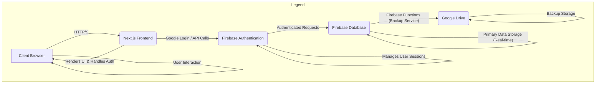

# Software Specification: Outfit Rental Order Management and Delivery Handling System

## 1. Introduction

This document outlines the functional and non-functional requirements for an outfit rental order management and delivery handling system. The software aims to streamline the process of managing outfit inventory, customer orders, and rental availability for fancy outfit rental showrooms. The application will function as a CRM-like admin dashboard on desktop and will support high-end Progressive Web App (PWA) features across desktop, Android, and iOS devices.

## 2. Functionality

### 2.1 Outfit Management

*   **Add/Edit Outfits:** Showroom members (owners) can add new outfit designs and their corresponding sizes to the system.
    *   **Bulk Design Addition:** A dedicated screen will allow owners to add multiple designs efficiently. This screen will feature:
        *   A large text input area for design name, code, and rent (in Indian currency format).
        *   Multiple-choice selection for sizes from a predefined list (28, 30, 32, 34, 36, 38, 40, 42, 44, 46).
        *   **Interaction Flow:** The default focus will be on the 'design name' field. Users can navigate between fields using the 'Tab' key. Multiple size choices can be selected via mouse or keyboard. Pressing 'Enter' will save the current design and prepare the screen for the next new design entry.
    *   **Outfit Details (for single additions/edits):** Each outfit will have the following attributes:
        *   Name
        *   Code (unique identifier)
        *   Rental Price (in Indian currency format)
        *   Image
*   **Size Management:** For each outfit design, multiple sizes can be added and managed.
*   **Search Outfits:** Showroom members can search for outfits by code or name.
*   **Availability View:** On the details page of each outfit design, a calendar view for the next six months will be displayed. This calendar will show:
    *   Days on which the specific design (and size, if applicable) is booked.
    *   Days on which the specific design (and size, if applicable) is available for rent.
    *   The calendar should be scrollable to view different months.
*   **Adjust Rent (Password Protected):** Showroom owners can adjust the rental price of each design. This functionality will be password protected.

### 2.2 Weekly Overview
*   **Current Week Overview (Password Protected):** Showroom owners can view an overview of the current week, indicating the number of designs currently on rent. Access to this overview will be password protected.

### 2.3 Order Management

*   **Add Orders:** Showroom members can add new orders for their customers. On the order confirmation screen, owners can add multiple outfits to a single order.
    *   **Outfit Items within an Order:** Each outfit added to an order will include:
        *   Design selection (via code or name search)
        *   Design size
        *   Rental price for that specific item
        *   Note (optional, for specific instructions or customizations per design)
    *   **Order Details (overall):** Each order will also include:
        *   Customer Name
        *   Customer Mobile Number
        *   Customer Address
        *   Advance Payment (amount paid by customer)
*   **View/Edit Orders:** Showroom members can view and modify existing orders.
*   **Tomorrow's Preparation View:** Showroom owners can view a list of all orders scheduled for delivery the following day, including the designs associated with each order, to ensure timely preparation.
*   **Outfit Return Process:** When a customer returns outfits, the owner can search for the customer's order using their mobile number. The system will display the order details, allowing the owner to:
    *   Assess and record any damage to the returned outfits.
    *   Apply any additional charges for damages.
    *   Mark the order as 'DONE' or 'Completed' once all items are returned and assessed.
*   **Delivery Handling (Future Scope/Integration Point):** While not explicitly detailed, the system should ideally have hooks or consider future integration for delivery management (e.g., assigning delivery personnel, tracking delivery status).
### 2.3 User Management (Implicit)

*   **Authentication:** The system will use Google Login for showroom members (owners) to authenticate and access the application.

## 3. Technical Stack Recommendation

For a fast, optimized, and scalable solution, I recommend a modern web application stack.

### 3.1 Frontend

*   **Language:** TypeScript
*   **Framework:** React (with Next.js for server-side rendering, routing, API routes, and PWA capabilities)
*   **Styling:** Tailwind CSS (for rapid UI development and highly optimized CSS)
*   **Calendar Component:** A robust React-based calendar library (e.g., `react-big-calendar` or similar, potentially customized for multi-month scrolling and availability highlighting).

**Justification:** React provides a highly component-based architecture, making UI development efficient and maintainable. Next.js offers excellent performance benefits with SSR, static site generation, and an integrated API route system. Its capabilities are well-suited for building high-end PWAs for desktop, Android, and iOS. TypeScript enhances code quality and developer experience with type safety. Tailwind CSS allows for quick and consistent styling.

### 3.2 Backend

*   **Language:** Node.js (with TypeScript) / Firebase Functions
*   **Framework:** Next.js API Routes (for certain server-side logic) and Firebase Functions (for backend logic, database interactions, and scheduled tasks)
*   **Database:** Google Firebase (Firestore or Realtime Database, chosen based on specific data access patterns)

**Justification:** Firebase provides a powerful, scalable, and real-time NoSQL database solution that integrates seamlessly with Google Login. It simplifies backend development significantly with serverless functions (Firebase Functions) for logic and automated tasks. The Firebase database for each showroom owner will be initialized upon their first login. Firebase security rules will be meticulously configured to ensure strict data isolation, meaning each showroom owner can only access their own data.

### 3.3 Data Backup

*   **Daily Google Drive Backup:** A Firebase Function will be scheduled to perform daily backups of each showroom owner's data from Firebase and upload it to their respective logged-in Google Drive account. This ensures data redundancy and provides owners with direct control over their backups.

### 3.4 Deployment

*   **Platform:** Vercel (for Next.js frontend and API routes) or a cloud provider like AWS/GCP (for backend services and database hosting).

**Justification:** Vercel offers seamless deployment for Next.js applications, including serverless functions for API routes. For the backend services and PostgreSQL database, a cloud provider like AWS or GCP will be utilized to ensure scalability, reliability, and security.

## 4. Future Considerations

*   **Delivery Management Module:** A dedicated module for assigning, tracking, and managing deliveries.
*   **Payment Gateway Integration:** Integration with online payment gateways for advance payments.
*   **Reporting and Analytics:** Dashboards for insights into rentals, popular designs, revenue, etc.
*   **Notifications:** SMS or email notifications for customers regarding order confirmations, delivery updates, etc.
## 5. High-Level Architecture

